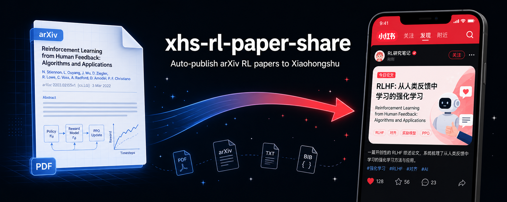
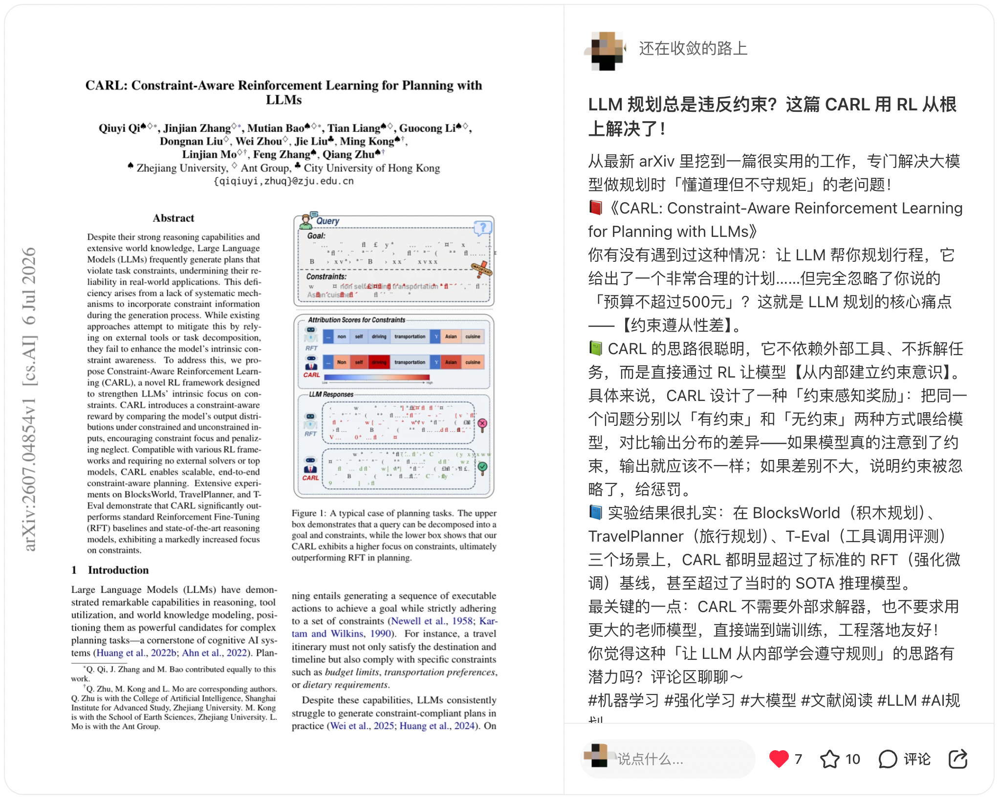

<div align="right">
  <a href="README.md">English</a>
</div>

<p align="center">
  
</p>

<p align="center">
  <a href="#-功能特性">功能特性</a> •
  <a href="#-安装">安装</a> •
  <a href="#-使用方法">使用方法</a> •
  <a href="#%EF%B8%8F-命令">命令</a> •
  <a href="#%EF%B8%8F-配置">配置</a> •
  <a href="#-分支说明">分支说明</a>
</p>

<p align="center">
  
  
  <a href="https://star-history.com/#GetIT-Sunday/xhs-rl-paper-share">
    
  </a>
</p>

---

## ✨ 功能特性

> **效果演示** — arXiv 论文首页（左）→ 小红书发布笔记（右）
>
> 

| 功能 | 说明 |
|---|---|
| 📄 论文抓取 | 从 arXiv 抓取最新 RL、具身智能、机器人学习论文 |
| ✍️ 文案生成 | 基于摘要生成小红书风格文案，无需 LLM API Key |
| 🖼️ 封面截取 | 自动截取 arXiv 论文首页作为封面图（依赖 PyMuPDF） |
| 📤 发布 | 调用小红书创作者 API 发布图文笔记，支持私密预览和公开发布 |
| 🔄 去重 | 维护已发布记录，避免重复发布 |

---

## 📦 安装

```bash
git clone https://github.com/GetIT-Sunday/xhs-rl-paper-share.git
cd xhs-rl-paper-share
pip install xhs xhshow PyMuPDF requests arxiv
```

### 依赖说明

| 包 | 用途 |
|---|---|
| `xhs` | 小红书 API 客户端 |
| `xhshow` | 实时请求签名（修复 xhs 内置过时签名） |
| `PyMuPDF` | PDF 首页转图片 |
| `requests` | HTTP 请求 |
| `arxiv` | arXiv 论文元数据 |

---

## 🚀 使用方法

### 1. 获取小红书 Cookie

登录[小红书创作者中心](https://creator.xiaohongshu.com)，打开浏览器开发者工具 → Application → Cookies → `creator.xiaohongshu.com`，复制 `a1`、`web_session`、`webId` 三个字段。

> ⚠️ **必须使用创作者中心的 Cookie**，普通用户端（`www.xiaohongshu.com`）的 Cookie 无法调用发布接口。

### 2. 抓取论文

```bash
python3 scripts/fetch_papers.py --count 5
# 结果写入 references/fetched_papers.json
```

### 3. 生成文案

```bash
python3 scripts/generate_content.py --arxiv-id 2606.24014
# 结果写入 references/content_2606_24014.json
```

### 4. 截取封面

```bash
python3 scripts/capture_cover.py --arxiv-id 2606.24014
# 直出 arXiv 论文首页截图，保存到 assets/covers/
```

### 5. 发布

```bash
# 私密预览（推荐先确认内容）
python3 scripts/publish_to_xhs.py \
  --content-json references/content_2606_24014.json \
  --cookie 'a1=xxx;web_session=xxx;webId=xxx' \
  --private

# 公开发布
python3 scripts/publish_to_xhs.py \
  --content-json references/content_2606_24014.json \
  --cookie 'a1=xxx;web_session=xxx;webId=xxx'
```

### 6. 定时任务（可选）

```bash
# cron: 每天 10:00 自动发布
0 10 * * * cd /path/to/repo && XHS_COOKIE='a1=xxx;...' python3 scripts/scheduled_publish.py
```

---

## 🛠️ 命令

| 脚本 | 命令 | 说明 |
|---|---|---|
| `fetch_papers.py` | `python3 scripts/fetch_papers.py --count N` | 从 arXiv 抓取 N 篇论文 |
| `generate_content.py` | `python3 scripts/generate_content.py --arxiv-id <ID>` | 生成小红书文案 |
| `capture_cover.py` | `python3 scripts/capture_cover.py --arxiv-id <ID>` | 截取封面图 |
| `publish_to_xhs.py` | `python3 scripts/publish_to_xhs.py --content-json <f> --cookie <c>` | 发布笔记 |
| `scheduled_publish.py` | `XHS_COOKIE='...' python3 scripts/scheduled_publish.py` | 全流程入口 |

---

## ⚙️ 配置

通过环境变量设置 Cookie，避免 Cookie 暴露在 shell 历史中：

```bash
export XHS_COOKIE='a1=xxx;web_session=xxx;webId=xxx'
python3 scripts/publish_to_xhs.py --content-json references/content_2606_24014.json
```

---

## 🌿 分支说明

| 分支 | 说明 |
|---|---|
| `main` | **通用版**：纯 Python，只依赖公开 PyPI 包，可在任意环境独立运行 |
| `dodo` | **dodo 集成版**：集成 dodo AI Agent 平台 Skill 协议、GPT Image 封面生成、论文精读报告等能力 |

---

## 📁 目录结构

```
xhs-rl-paper-share/
├── scripts/
│   ├── fetch_papers.py        # 从 arXiv 抓取论文
│   ├── generate_content.py    # 生成小红书文案
│   ├── capture_cover.py       # 截取封面
│   ├── publish_to_xhs.py      # 发布到小红书
│   ├── cookie_manager.py      # Cookie 管理
│   └── scheduled_publish.py   # 定时发布入口
├── references/
│   ├── fetched_papers.json    # 抓取到的论文列表
│   ├── published_papers.json  # 已发布记录（初始为空）
│   ├── publish_state.json     # 发布状态
│   ├── paper_template.md      # 文案模板说明
│   └── xhs_style_guide.md     # 小红书风格指南
├── assets/
│   └── covers/                # 封面图（运行时生成，已 .gitignore）
├── .gitignore
├── README.md                  # English
└── README_ZH.md               # 中文文档（本文件）
```

---

## ⚠️ 注意事项

- **Cookie 安全**：`web_session` 是登录凭证，不要提交到版本控制
- **发布频率**：建议每天不超过 3 篇，避免触发小红书风控
- **Cookie 时效**：创作者中心 Cookie 约 30 天有效，过期需重新获取
- **签名说明**：`xhs` 内置旧版签名已被风控识别，本项目已 monkey-patch 为 `xhshow` 实时签名

---

## 🤝 贡献

欢迎提交 Issue 和 Pull Request！

---

## 📄 许可证

MIT

---

<p align="center">
  <a href="https://star-history.com/#GetIT-Sunday/xhs-rl-paper-share&Date">
    
  </a>
</p>
