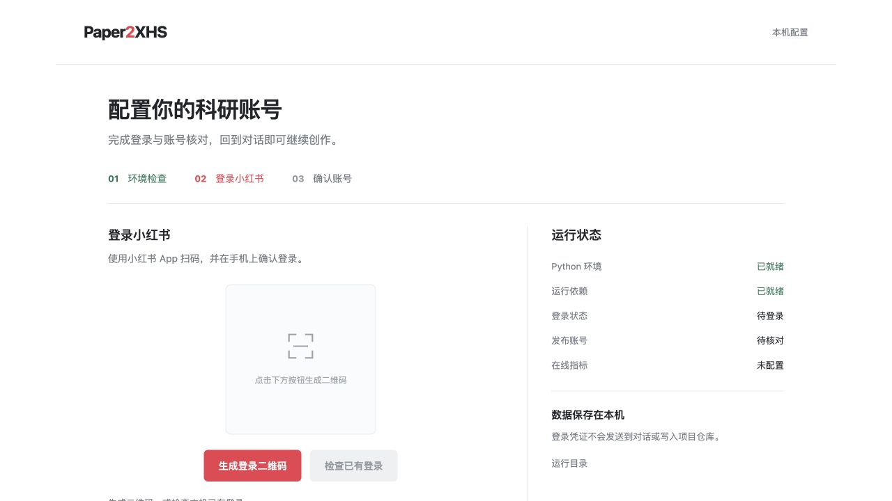
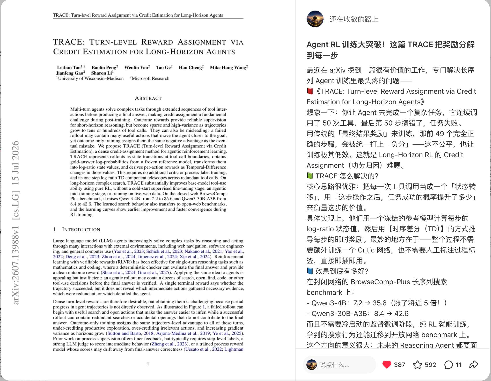

<div align="center">


# Paper2XHS

**把科研论文写成小红书内容，用运营反馈帮助下一次选题。**

面向强化学习、具身智能和机器人学习领域研究者与科普创作者的 Agent Skill。

[English](README.md) · 简体中文


[](https://github.com/GetIT-Sunday/xhs-rl-paper-share)

[快速开始](#快速开始) · [账号配置](#账号配置与发布) · [可以做什么](#可以做什么) · [反馈决策](#让反馈参与决策) · [文档](#文档)

</div>

## 快速开始

把下面这句话发给具备 GitHub Skill 安装能力的 Agent：

```text
Help me install Paper2XHS from https://github.com/GetIT-Sunday/xhs-rl-paper-share with Skills. Install the repository root as the paper2xhs skill.
```

安装后新建会话或刷新 Skills，先生成一篇可检查的草稿：

```text
使用 $paper2xhs，选一篇近期机器人学习论文，生成有证据支撑的中文小红书草稿和论文首页封面。先展示结果，暂不发布。
```

你会得到：**论文选题、Evidence Pack、中文草稿和 PDF 首页封面**。当前 Agent 负责中文写作，脚本负责召回、证据整理和文件处理。生成草稿无需小红书登录，也不必单独配置 LLM API Key。

**环境要求：**Python 3.10+、macOS/Linux 或 Windows WSL，以及能够运行本机脚本的 Skill Agent。安装依赖和获取论文需要联网；账号配置页需要浏览器。

<details>
<summary><strong>手动安装到 Codex</strong></summary>

```bash
git clone https://github.com/GetIT-Sunday/xhs-rl-paper-share.git \
  "${CODEX_HOME:-$HOME/.codex}/skills/paper2xhs"
```

目录已存在时，请先更新或备份。也可将维护者提供的 `paper2xhs.zip` 解压到 Skills 目录，保留完整的 `paper2xhs/` 文件夹及其中的脚本和参考文档。

</details>

## 账号配置与发布

准备发布时，直接告诉 Agent：

```text
使用 $paper2xhs，打开账号配置向导。登录并核对账号后，展示刚才的成稿和封面，按我的发布要求继续。
```

| 步骤 | 你需要做什么 | Paper2XHS 会做什么 |
|---|---|---|
| 1. 检查环境 | 打开 Agent 提供的本机配置页 | 检查依赖和登录缓存，展示运行状态 |
| 2. 扫码登录 | 用小红书 App 扫码，在手机上确认 | 获取登录状态，读取平台返回的真实账号 |
| 3. 确认账号 | 核对昵称、账号 ID 和主页，点击确认 | 保存本机配置，将完成状态交回 Agent |
| 4. 发布成稿 | 检查账号、标题、正文和封面，说明发布意图 | 发布前再次在线核实账号，并记录平台返回结果 |

配置页支持检查已有登录和切换账号。它仅监听本机地址，默认 15 分钟后关闭；Cookie 不进入聊天、日志或 Skill 包。**保存配置不会发布内容，也不会启动定时任务。**

支持内置浏览器的 Agent 可在对话旁展示页面，其他宿主使用本机浏览器。这是 Skill 启动的本地网页；远程 Agent 需要本地运行环境或端口转发。在线指标采集仍需另行核对字段映射。

### Agent 对话旁的配置页面

当 Skill 发现账号尚未配置时，Agent 会在对话旁打开这个本机页面。你在页面里完成扫码、账号核对和确认，再回到对话继续生成或发布；截图中的二维码和账号信息已脱敏。



*界面示意：页面由 Skill 在本机启动，保存配置不会自动发布。*

## 可以做什么

| 能力 | 实际功能 |
|---|---|
| **选择论文** | 从 arXiv 召回候选，按发布历史去重，结合主题相关性、时效性、证据量和适用策略权重排序。 |
| **依据证据写作** | 将来源链接、摘要片段、数字和术语写入 Evidence Pack，由当前 Agent 整理成中文草稿。 |
| **配置与发布** | 本机扫码、核对真实账号；准备 PDF 首页封面和话题标签，在用户要求时发布。 |
| **使用运营反馈** | 导入报表或使用可配置的创作者中心适配器，保存带时间戳的快照并更新表达策略权重。 |
| **保留决策记录** | 记录实际使用的策略和权重版本；凭证、草稿、发布历史与运营数据保存在用户本机。 |

你可以这样说：

- “用 $paper2xhs 面向机器人学习读者解读这篇 arXiv 论文，说明方法、证据和局限。”
- “用 $paper2xhs 导入这份创作者报表，解释反馈对选题排序有什么影响。”
- “用 $paper2xhs 发布我已确认的成稿，并记录它使用的表达策略。”

**Skill 写作和脚本生成有所不同：**完整中文成稿由当前 Agent 完成；独立生成脚本和无人值守脚本调度目前输出摘要模板。

## 示例输出



*从论文到已发布笔记：这是项目已有示例，不是实时指标看板。*

## 可追溯的内容依据

**Evidence Pack（证据包）**是论文材料所支持内容的本地记录，包括来源链接、摘要片段、数字和术语。Agent 据此核对草稿中的方法与结果。

内置检查器可以标记部分无依据数字和英文术语，不是完整语义事实核验；当前发布脚本也仅将检查结果作为警告。超出摘要范围的结论，需要阅读全文并补录证据。

成稿 JSON、策略标签和来源要求见[内容与归因指南](references/skill-content.md)。

## 让反馈参与决策

反馈路径为：**运营指标 → 时间快照 → 平滑策略权重 → 候选排序与文案策略**。

- **区分指标。**缺失计数保持未知；阅读量不等于曝光量，账号净涨粉也不自动归因到单篇笔记。
- **对齐观察时长。**通常取每篇笔记发布后 24–30 小时的一次有效观测，要求曝光已知且策略可归因；重复采集不会增加学习样本。
- **平滑小样本反馈。**使用 capped Gamma–Poisson 事件率估计，每篇笔记的曝光贡献上限为 10,000，只更新实际使用策略的权重。
- **记录如何决策。**候选排序和模板生成读取策略；发布调度器会重新排列缓存和新候选，并保存选择记录。

这些权重反映观察相关性，不能证明策略带来因果提升。没有可用策略时，文案默认采用中性解释方式。

**本地 CSV/JSON 导入可用；在线采集需登录并验证字段映射。**配置示例是合成结构，计数口径默认 `unknown`，确认后台提供逐笔累计值后才可设为 `lifetime`。启用在线采集或周期发布前，请阅读[运维指南](references/skill-operations.md)。

## 在终端运行

开发者或习惯脚本的用户可以直接运行：

```bash
git clone https://github.com/GetIT-Sunday/xhs-rl-paper-share.git
cd xhs-rl-paper-share
python3 scripts/paper2xhs.py doctor
python3 scripts/paper2xhs.py setup
python3 scripts/paper2xhs.py run fetch -- --count 5 --days 7
python3 scripts/paper2xhs.py prepare
```

`prepare` 从已有候选中选题并输出草稿路径，不会发布。`--count` 是每个搜索关键词的召回数量，不是最终论文总数。如果 `python3` 低于 3.10，请改用已安装的新版解释器，例如 `python3.12`。

需要登录时，在单独终端启动配置页：

```bash
python3 scripts/paper2xhs.py configure
```

打开首行 JSON 的 `url` 并保持该终端运行。完成页面确认后，在另一终端运行 `doctor` 检查 `configuration_complete`；纯草稿流程可跳过这一步。发布命令和指标配置见[运维指南](references/skill-operations.md)。

私有工作目录默认为 `~/.local/share/paper2xhs/`：

| 位置 | 内容 |
|---|---|
| `app/references/` | 候选论文和草稿 |
| `app/assets/covers/` | 论文首页封面 |
| `data/` | 指标快照、策略权重、报告、决策及发布记录 |
| `cookie.json` | 配置登录后保存的本地凭证缓存 |
| `config.json` | 已确认账号及凭证指纹 |
| `configure-status.json` | 配置会话状态，供 Agent 继续原任务 |

通过 `PAPER2XHS_HOME` 修改工作目录，不同账号使用不同目录。`doctor` 展示实际路径而不显示凭证。更新 Skill 会刷新程序文件，保留已有私有数据。

<details>
<summary><strong>离线准备与反馈报告</strong></summary>

`setup --skip-deps` 可准备仅使用标准库的工作流，不安装第三方依赖，也不会启用在线发布或 PDF 渲染。

```bash
python3 scripts/paper2xhs.py setup --skip-deps
python3 scripts/paper2xhs.py run feedback -- report
```

导入自己的报表时，向 Agent 提供绝对文件路径。先做 dry-run，核对时间、计数口径、账号和字段映射后再写入账本。

</details>

## 当前边界

| 功能 | 状态 |
|---|---|
| 平台在线访问 | 使用非官方适配器，需在用户账号上验证登录、签名兼容性和当前指标字段。 |
| 发布 | 安装与本地预览不会发布；`--private` 会在平台创建真实的私密笔记。 |
| 调度 | `run schedule` 可能等待发布时间槽，再发布一篇内容；它不会自动注册周期任务。 |
| 可选集成 | Skill 暂不通过 MCP/Bridge 发布：它们拥有独立登录态，不能复用本配置页的账号核验结果。 |
| 高级封面 | 自带论文首页封面；模型生图需要单独配置相应能力。 |

## 常见问题

<details>
<summary><strong>二维码过期或配置页打不开？</strong></summary>

二维码过期后点击“重新生成二维码”。配置服务默认 15 分钟退出，链接失效后让 Agent 重新打开。远程运行时，要确认浏览器能连接 Agent 所在机器的本机服务；不要将配置端口公开暴露到公网。

</details>

<details>
<summary><strong>已经扫码，为什么还不能发布？</strong></summary>

扫码成功后还需要平台返回真实账号，并由你在页面确认。验证码、签名错误或账号变化都会中止核验；保留成稿，在小红书官方界面完成必要验证后重试。配置完成不代表已实测所有发布或指标接口。

</details>

<details>
<summary><strong>arXiv 接口失败，是否需要修改代码？</strong></summary>

召回会对临时请求失败进行重试；最终失败会明确报错并保留已有候选。可以稍后重试，或让 Agent 处理你指定的论文和可访问的原文材料。

</details>

## 文档

| 文档 | 用途 |
|---|---|
| [上手教程](README_TUTORIAL.md) | 从安装 Skill 到发布第一篇内容的完整流程 |
| [Skill 指令](SKILL.md) | Agent 入口、支持任务和执行边界 |
| [内容指南](references/skill-content.md) | 论文证据、中文写作和策略归因 |
| [运维指南](references/skill-operations.md) | 登录、指标映射、私有存储和调度 |
| [指标配置示例](examples/creator_metrics.config.example.json) | 核对真实 schema 后建立采集配置 |
| [测试](tests/) | 快照、策略、发布元数据及隔离安装包验证 |

项目结构：

```text
SKILL.md                     Agent 的任务与执行规则
scripts/paper2xhs.py          统一命令入口与私有运行目录
scripts/configure.*            本机账号配置页
scripts/account_state.py       账号确认与发布前核验
scripts/                      召回、证据、封面、发布和反馈模块
references/                   写作与运营说明
examples/                     脱敏的指标映射示例
tests/                        隔离安装、账号边界及反馈测试
```

真实账号数据保存在私有工作目录，不属于上述发行包结构。

## 参与贡献

欢迎通过 [Issues](https://github.com/GetIT-Sunday/xhs-rl-paper-share/issues) 提交可复现的问题，或发起 Pull Request。修改平台适配器时，请用脱敏样例说明已验证的字段口径，不附带 Cookie 和真实账号导出数据。

```bash
python3 -m unittest discover -s tests -v
python3 scripts/package_skill.py
```

打包程序使用明确的文件清单生成 `dist/paper2xhs.zip`，排除历史笔记、凭证和运营数据；发布 Release 是维护者单独执行的操作。

## 许可证

旧文档标注 MIT，但当前仓库没有 `LICENSE` 文件。维护者需要确认许可证并补充正文，才能明确项目的授权状态。

## Star history

[](https://star-history.com/#GetIT-Sunday/xhs-rl-paper-share&Date)
